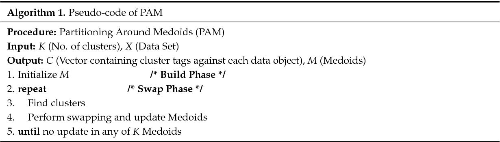

The identification of molecular disease subtypes has emerged as a central objective in cancer research, as it enables a more precise understanding of disease heterogeneity and guides the development of personalized therapeutic strategies.
Multi-omics data, encompassing diverse molecular layers such as gene expression (mRNA), microRNA (miRNA), and protein levels, offers a comprehensive view of the biological processes underlying cancer progression. 
This holistic approach facilitates the identification of clinically meaningful subtypes that may not be discernible through single-omics analyses.

Despite its potential, the integration and analysis of multi-omics data presents significant challenges. Issues such as missing values, differences in data scale and type, and the selection of appropriate similarity measures complicate the analysis pipeline @tini2022multi-omics. The choice of integration strategy can profoundly influence clustering results, where samples are grouped based on molecular similarity.
Consequently, robust and efficient integration and clustering methods are essential for meaningful subtype discovery.

In this study, we leverage two approaches for multi-omics data integration: a graph-based algorithm called Similarity Network Fusion (SNF) @wang2014similarity and a simple averaging of similarity matrices. For clustering, we utilize Partitioning Around Medoids (PAM) @PAM and Spectral Clustering @von2007SP.

Our goal is to evaluate whether the clusters derived from these multi-omics integration and clustering methods correspond to the molecular subtypes identified by the iCluster integrative model @shen2009integrative used by The Cancer Genome Atlas Research Network @abeshouse2015molecularPRAD. 


# Install packages
First of all, we need to install all the packages needed for the project:

```{r}
# Check if BiocManager is installed; if not, install it
if (!require("BiocManager", quietly = TRUE))
    install.packages("BiocManager")

# Install required Bioconductor packages for working with TCGA data
BiocManager::install("curatedTCGAData")
BiocManager::install("TCGAutils")
BiocManager::install("TCGAbiolinks")
BiocManager::install("graph")

# Install CRAN packages
install.packages("SNFtool")
install.packages("NetPreProc")
install.packages("caret")
install.packages("cluster")
install.packages("mclustcomp")
```

# Load packages
Now we can load the packages:

```{r message=FALSE, warning=FALSE}
library("curatedTCGAData")
library("TCGAbiolinks")
library("TCGAutils")
library("SNFtool")
library("NetPreProc")
library("caret")
library("cluster")     #pam algorithm
library("mclustcomp")
```

# What is multi-omics data?

Multi-omics data refers to the integration and analysis of multiple types of **"omics"** data generated from biological systems, aiming to provide a comprehensive understanding of the underlying molecular mechanisms @hasin2017multi-omics. Each type of omics data captures information at different biological levels, enabling researchers to examine the relationships and interactions between these levels in a holistic manner.

Omics data types:

* *Gen**omics**:* focuses on DNA sequences, including genetic variations and mutations, to understand the genetic basis of diseases.
* *Transcript**omics**:* analyzes RNA expression levels to study gene activity and its regulation under various conditions.
* *Prote**omics**:* investigates protein expression, modifications, and interactions to explore cellular functions and signaling pathways.
* *Epigen**omics**:* studies DNA methylation, histone modifications, and chromatin structure to understand gene regulation mechanisms.
* *Metabol**omics**:* analyzes small molecules and metabolites to assess cellular metabolic states.
* *Microbi**omics**:* examines the composition and functions of microbial communities in relation to host health and disease.

<center>
)](./images/Multi-omic-strategy-in-Prostate-cancer-study.png){}
</center>

# Prostate adenocarcinoma multi-omics dataset

We download a Prostate adenocarcinoma multi-omics dataset from 
The Cancer Genome Atlas (TCGA) program @hutter2018TCGA.
TCGA is a large-scale genomics initiative that has collected and analyzed molecular data from over 11,000 cases across 33 tumor types. The project integrates various biological data types, including mRNA expression, miRNA expression, DNA copy number variations, DNA methylation, and protein expression, enabling comprehensive multi-omics analyses.  
For this study, we utilize the “curatedTCGAData” package @ramos2020curatedTCGAData
to access and download the following omics data views:

* mRNA data
* miRNA data
* protein data

The complete list of data types is available in the help page of the function
*?curatedTCGAData*.

```{r message=TRUE}
# Step 1

# Define the assays considering mRNA, miRNA and protein expression data
assays <- c("miRNASeqGene", "RNASeq2Gene", "RPPAArray")

# Note that RPPA stands for Reverse-phase protein array and it is the technology used to obtain proteomic data.
# RNASeq stands for RNA-Sequencing and it is the technology used to measure mRNA and miRNA expression.

# Download the PRAD dataset (multi-omics)
mo <- curatedTCGAData(diseaseCode = "PRAD", assays = assays, version = "2.0.1", dry.run = FALSE)

# Use ?curatedTCGAData to access the help page of the function and
# see the table with all the available data types (not all types are available for each cancer).

# Print summary of mo:
mo
```
As we can see, we obtain a MultiAssayExperiment object.

```{r message=TRUE}
# Print first 5 rows and columns of mo dataset:
colData(mo)[1:5, 1:5]

# Extract and print the column names:
colnames(colData(mo))
```

## What is a MultiAssayExperiment object?

A MultiAssayExperiment object is a data structure designed to manage, integrate, and analyze multi-omics datasets collected from the same set of biological samples @ramos2017MultiAssayExperiment, such as patients in a clinical study.

The three key components of this data structure are:

* *ExperimentList:* a collection of individual assays, where each assay corresponds to a specific omics dataset (e.g., RNA-Seq, miRNA expression, methylation, or proteomics). Each assay is typically represented as a structured object, such as a SummarizedExperiment, ExpressionSet, or a matrix-like object. - access **experiments()**

* *ColData:* it contains metadata about the biological samples (columns in the assays).  It includes clinical and phenotypic information (e.g., patient ID, age, sex, tumor stage, treatment details). - access **colData()**

* *SampleMap:* a mapping table that links the sample identifiers in the assays to the unified biological sample identifiers (e.g., patient IDs) - access **sampleMap()**

<center>
)](./images/MultiAssayExperiment.png){width=70%}
</center>


# Data preprocessing

Each sample/patient is identified by a barcode with a specific structure:

<center>
)](./images/barcode.png){width=70%}
</center>

Components of the barcode:

* **Project Code:** indicates the data source or the project under which the sample was collected.
* **Tissue Source Site (TSS):** a two-character code identifying the site where the sample was collected, such as a specific hospital, clinic, or research institution.
* **Participant ID:** a four-character code uniquely identifying the patient.
* **Sample Type:** a three-character code denoting the type of sample ( [here](https://gdc.cancer.gov/resources-tcga-users/tcga-code-tables/sample-type-codes) the list with all sample types code) and its preparation.
* **Portion Number:** a two-digit number specifying the portion of the sample taken for analysis.
* **Analyte Type:** a single letter representing the type of analyte extracted (i.e., **D**: DNA, **R**: RNA, **P**: protein).
* **Plate ID:** a unique identifier for the plate used during sample processing.
* **Center Code:** a two-digit code denoting the sequencing or data generation center.

The first three components (Project Code, TSS, Participant ID) uniquely identify a specific individual, while
the remaining components provide detailed metadata about the sample itself.

We use the barcode to:

* Retain only Primary Solid Tumors (identified by the sample type code "01") to have a more homogeneous group of samples. 
* Exclude technical replicates in the dataset (i.e., repeated measurements from the same sample), identified by analyzing the Portion Number and other metadata.

The barcode facilitates the alignment and integration of data across different assays (e.g., RNA-seq, proteomics) and ensures consistent metadata annotation.

```{r message=FALSE, warning=FALSE}
# Step 2

# Consider only primary solid tumors:
primary <- TCGAutils::TCGAsampleSelect(colnames(mo), c("01"))
mo <- mo[, primary, ]

# Check for replicates
# (anyReplicated checks the so called biological or primary unit in the sampleMap of the MultiAssayExperiment object, that corresponds to the first 12 characters of the barcodes for TCGA data):
check_rep <- anyReplicated(mo)
print(check_rep)
```

Then, other additional pre-processing steps are performed:

* *Removal of FFPE Samples:* Formalin-Fixed, Paraffin-Embedded (FFPE) samples are removed from the dataset, as these preservation methods are known to degrade data quality. Excluding FFPE samples ensures that only high-quality data is used in the analysis.

* *Retention of Complete Multi-Omics Data Samples:* only samples with data available across all the considered omics modalities (mRNA, miRNA, and protein expression) are retained. This step ensures that clustering and data integration methods are applied consistently across the full dataset, avoiding issues caused by missing values in any omics layer.  
The filtered dataset is then separated into individual matrices, with one matrix corresponding to each omics data type, and stored in a list for further processing.

* *Matrix Transposition:* each matrix is transposed such that samples are represented as rows and features (e.g., genes, proteins) are represented as columns. This format is required by most clustering and integration algorithms, which assume that rows correspond to individual samples and columns to features.

```{r}
# The information regarding if the sample is FFPE is stored in the clinical data,
# which are accessible using colData(). 
no_ffpe <- which(as.data.frame(colData(mo))$patient.samples.sample.is_ffpe == "no")

# Keep only samples that are not FFPE
mo <- mo[, no_ffpe, ]

# Find the samples that have all three types of omics data (miRNA, RNA, and protein):
complete <- intersectColumns(mo)

# Extract assays in list:
complete <- assays(complete)

# Obtain matrices samples x features:
complete <- lapply(complete, FUN=t)   # Transpose to get samples as rows
```

* *Removal of features with missing values:* features containing missing values (i.e., NA) are removed from the dataset. This approach is chosen over imputation since the presence of missing values is limited to a small subset of features within the proteomics data.

* *Feature selection:* to reduce the dimensionality of the dataset while retaining its most significant features, the top 100 features with the highest variance are selected from each data source (mRNA, miRNA, and protein expression).
This feature selection strategy is widely used due to its simplicity and computational efficiency.  
However, it has some limitations: 
(1) Univariate Nature: it evaluates features independently, ignoring interactions between them.
(2) Inability to Remove Redundancy: highly correlated or redundant features are not filtered out.
(3) Arbitrary Thresholds: choosing a fixed number of top features (e.g., 100) is inherently subjective and may not suit all datasets.

* *Normalization:* feature values are standardized using the z-score method, where each feature's values are transformed to have a mean of 0 and a standard deviation of 1. This ensures comparability across features by removing scale differences.

* *Barcode Cleaning:* TCGA sample barcodes are trimmed to retain only the consistent components: "Project-TSS-Participant". This ensures uniformity across all omics datasets, enabling accurate matching and alignment of samples.

```{r message=TRUE}
# Remove features having NAs (present only in proteomics data):
complete[[3]] <- complete[[3]][, colSums(is.na(complete[[3]])) == 0]

# Select the top 100 most variable features from each omics dataset
nf <- 100

for(i in 1:length(complete)){
  
    # Remove features with near-zero variance
    idx <- caret::nearZeroVar(complete[[i]])
    message(paste("Removed ", length(idx), "features from", names(complete)[i]))
    if(length(idx) != 0){
        complete[[i]] <- complete[[i]][, -idx]
    }
    
    # Retain top 100 features with highest variance
    if(ncol(complete[[i]]) <= nf) next
    
    vars <- apply(complete[[i]], 2, var)
    idx <- sort(vars, index.return=TRUE, decreasing = TRUE)$ix
    
    complete[[i]] <- complete[[i]][, idx[1:nf]]
    
}


# Perform features standardization using z-score:
zscore <- function(data){
    
    zscore_vec <- function(x) { return ((x - mean(x)) / sd(x))}
    data <- apply(data, 2, zscore_vec)
    
    return(data)
}

complete <- lapply(complete, zscore)

# Clean the sample barcodes retaining only "Project-TSS-Participant":
for(v in 1:length(complete)){
    rownames(complete[[v]]) <- substr(rownames(complete[[v]]), 1, 12) # first 12 characters
}
```


# Prostate adenocarcinoma disease subtypes

The integrative analysis of prostate adenocarcinoma (PRAD) has revealed seven distinct genomic alterations, which include fusions involving **ERG**, **ETV1**, **ETV4**, and **FLI1**, as well as mutations in **SPOP**, **FOXA1**, and **IDH1**.  
Through the integration of genomic, transcriptomic, and epigenomic data, PRAD can be classified into three distinct molecular subtypes. This classification was achieved using the iCluster integrative clustering method @shen2009integrative, which combines multiple layers of omics data (somatic copy-number alterations, DNA methylation, mRNA, microRNA and Protein expression) to identify robust clusters that reflect key biological features of the disease.  
The subtypes were defined through comprehensive molecular profiling of 333 primary prostate cancer samples from The Cancer Genome Atlas Research Network @abeshouse2015molecularPRAD.

```{r}
# Step 3

# Download disease subtypes from TCGAbiolinks
subtypes <- as.data.frame(TCGAbiolinks::PanCancerAtlas_subtypes())
subtypes <- subtypes[subtypes$cancer.type == "PRAD", ]

# Retain only primary solid tumors and select samples in common with omics data (in the same order):
subtypes <- subtypes[TCGAutils::TCGAsampleSelect(subtypes$pan.samplesID, "01"), ]
sub_select <- substr(subtypes$pan.samplesID,1,12) %in% rownames(complete[[1]])
subtypes <- subtypes[sub_select, ]
rownames(subtypes) <- substr(subtypes$pan.samplesID, 1, 12)
subtypes <- subtypes[rownames(complete[[1]]), ]

# Step 4: Ensure that subtypes and omics data samples are in the same order

# Get the common sample IDs between the omics dataset and subtypes
common_samples <- intersect(rownames(subtypes), rownames(complete[[1]]))

# Subset both subtypes and omics data to retain only the common samples
subtypes <- subtypes[common_samples, ]
for (i in 1:length(complete)) {
    complete[[i]] <- complete[[i]][common_samples, ]
}

# Now check if they are in the same order
all(rownames(subtypes) == rownames(complete[[1]]))  # Should return TRUE

# Print number of samples for each subtype:
table(subtypes$Subtype_Selected)
```


# Multi-omics data integration

Integrating different omics data remains a significant challenge in the scientific community, with numerous methods proposed to address this issue @gliozzo2022heterogeneous.
These methods aim to effectively combine heterogeneous data types to capture the complex biological processes underlying diseases.

To fuse our Prostate adenocarcinoma dataset, we will use a state-of-the-art approach called **Similarity Network Fusion** (SNF) @wang2014similarity, implemented in the CRAN package SNFtool.
This approach constructs and iteratively fuses similarity networks for each omics dataset, effectively capturing both shared and complementary information across data types.

In addition to SNF, we use a simple averaging method as a baseline integration approach.
This method combines the similarity matrices from individual omics datasets through straightforward element-wise averaging, providing a reference point for evaluating the effectiveness of advanced integration techniques.

## Similarity Network Fusion

The similarity metric used in SNF can vary, but the scaled *exponential Euclidean distance* is commonly employed due to its ability to emphasize small differences and manage scale variability across datasets. 

Steps in SNF with Scaled Exponential Euclidean Distance: 

(1) *Compute Pairwise Distances:* for each data type, calculate the Euclidean distance between all pairs of entities $i$ and $j$.
  \begin{equation}
    \label{eq:euclidean_distance}
    d(i,j) = \sqrt{\sum_k(x_{ik}-x_{jk})^2}
  \end{equation}
  
(2) *Apply the Scaling and Exponential Transformation:* convert the Euclidean distances into similarity scores using the scaled exponential Euclidean distance formula.
  \begin{equation}
    \label{eq:scaled_exponential_sim}
    W^{(s)}(i,j) = \exp\left(- \frac{d^2(i, j)}{\sigma^2}\right)
  \end{equation}
where $\sigma$ is a scaling parameter that adjusts the sensitivity of the similarity measure to the pairwise distances.  
Smaller distances lead to higher similarity scores, while larger distances are exponentially down-weighted. This method also ensures robustness to outliers and enhances sensitivity to local structures.

(3) *Construct Initial Similarity Networks:* each similarity matrix represents the relationships between entities based on one data type. 

(4) *Derive Global and Local Similarity Matrices:* construct the "global" similarity matrix $P^{(s)}$, capturing the overall structure of relationships among samples.
  \begin{equation}
  \label{eq:global_kernel}
    P^{(s)}(i,j) = 
    \begin{cases}
      \frac{W^{(s)}(i,j)}{2 \sum_{k \neq i} W^{(s)}(i,k)} & \text{, if $j \neq i$}\\
      1/2 & , \text{if $j = i$}\\
    \end{cases}       
  \end{equation}
For this equation the property $\sum_{j} P(i,j)=1$ holds.  
Construct the "local" similarity matrix $S^{(s)}$, which emphasizes neighborhood-based relationships by focusing on the *k*-nearest neighbors $N_i$ of each sample $x_i$.
  \begin{equation}
  \label{eq:local_kernel}
    S^{(s)}(i,j) = 
    \begin{cases}
      \frac{W^{(s)}(i,j)}{\sum_{k \in N_i} W^{(s)}(i,k)} & \text{, if $j \in N_i$}\\
      0 & , \text{otherwise}\\
    \end{cases}       
  \end{equation}

(5) *Iterative Fusion:* combine similarity networks iteratively, sharing and updating information between networks to create a unified, consensus similarity matrix.  
For two data modalities ($s$=2):
  \begin{equation}
    \label{eq:update}
    \begin{aligned}
        P^{(1)}_{t+1}=S^{(1)} \times P^{(2)}_{t} \times S^{(1)\top} \\
        P^{(2)}_{t+1}=S^{(2)} \times P^{(1)}_{t} \times  S^{(2)\top}  
    \end{aligned}
  \end{equation}
Here, $t$ is the iteration index.

(6) *Converged Output:* the final fused network represents an integrated view of the relationships across all data types. 
  \begin{equation}
    \label{eq:consensus}
    P^{(c)} = \frac{1}{s} \sum_{k=1}^{s} P^{(k)}
  \end{equation}
Where $s$ is the total number of data sources.

```{r}
# Step 5

# Compute similarity matrix for each data source (miRNA, RNA, and protein)
# using the scaled exponential euclidean distance
W_list <- list()
for(i in 1:length(complete)){
    Dist <- (dist2(as.matrix(complete[[i]]), as.matrix(complete[[i]])))^(1/2)   # Euclidean distance
    W_list[[i]] <- affinityMatrix(Dist)   # Convert distance matrix to affinity matrix
}
    
# Integrate multi-omics data using SNF (t=20 iterations, k=20 neighbors)
W_snf <- SNF(W_list, K=20, t=20)
```

## Simple Average

The similarity matrices computed from each omics layer are averaged to produce a single integrated similarity matrix. 

```{r}
# Step 6: Compute the simple average integration of similarity matrices
W_avg <- Reduce("+", W_list) / length(W_list)
```


# Disease subtype discovery by clustering approaches

To identify disease subtypes, we will employ the following algorithms:

* Partitioning Around Medoids (PAM) @PAM
* Spectral Clustering @von2007SP

## PAM

The **Partitioning Around Medoids** (PAM) algorithm @Mushtaq2018PAM is a robust clustering technique that groups data into clusters using representative data points called *medoids*. Unlike centroids used in **k-means**, medoids are actual data points, making PAM particularly effective for non-Euclidean distance measures and datasets with noise or outliers. 
<center>
  
</center>

The algorithm operates in two main phases:

* *BUILD PHASE:* initializes the clustering process by selecting $k$ initial medoids.
  
The computational complexity is $O(k*n^2)$, as it involves evaluating the dissimilarities between all pairs of points during the medoid initialization.

* *SWAP PHASE:* iteratively improves the medoids to further reduce the total clustering cost.
  
The computational complexity is $O(k*(n-k)^2)$, as it examines potential swaps between medoid and non-medoid points to identify configurations that reduce the overall clustering cost.

The primary goal of PAM is to minimize the average dissimilarity of the objects to their closest selected medoid. By doing so, it ensures that the chosen medoids represent the data clusters effectively.  
PAM is computationally more expensive than k-means, primarily due to the $O(k*(n-k)^2)$ complexity of the Swap Phase.  
This limits its scalability for large datasets.

We apply the PAM algorithm to: 

* Individual similarity matrices (mRNA, miRNA, and protein). 
* The integrated matrix from the simple average method. 
* The integrated matrix from SNF. 

We set the number of clusters (k=3) to the number of disease subtypes found by iCluster.

```{r}
# Step 8: Clustering using PAM on different similarity matrices

# a: PAM clustering on single data sources (miRNA, mRNA, and proteins)
pam_res_list <- list()
for (i in 1:length(W_list)) {
    dist_matrix <- 1 - NetPreProc::Max.Min.norm(W_list[[i]])  # Normalize similarity matrix
    D <- as.dist(dist_matrix)                                 # Convert to distance matrix
    pam_res_list[[i]] <- pam(D, k = 3)                        # PAM clustering with k=3
}

# b: PAM clustering on the integrated matrix (average)
dist_avg <- 1 - NetPreProc::Max.Min.norm(W_avg)
D_avg <- as.dist(dist_avg)
pam_res_avg <- pam(D_avg, k = 3)

# c: PAM clustering on integrated matrix from SNF
dist_snf <- 1 - NetPreProc::Max.Min.norm(W_snf)
D_snf <- as.dist(dist_snf)
pam_res_snf <- pam(D_snf, k = 3)
```

## Spectral Clustering

**Spectral Clustering** @von2007SP @ng2002spectralclustering graph-based clustering algorithm that uses the eigenvalues (spectrum) of a similarity matrix derived from the data to perform dimensionality reduction before clustering in fewer dimensions @wiki:Spectral_clustering.  
It is particularly effective for identifying clusters in non-convex and complex data distributions.

The main steps of the algorithm are showed below:
<center>
)](./images/Spectral_Clustering.png){width=80%}
</center>

Advantages:

* Handles complex cluster shapes.
* Works with diverse similarity measures.

Divadvantages:

* Computing eigenvalues for large datasets can be expensive ($O(n^3)$).
* Sensitive to hyperparameters like similarity function and number of clusters $k$.

We apply the Spectral Clustering on the integrated matrix from SNF.

```{r}
# Step 10: Apply Spectral Clustering on the SNF integrated matrix
clusters_spectral <- SNFtool::spectralClustering(W_snf, K = 3)
```


# Compare clustering results with iCluster subtypes

Now, we want to compare the computed clusterings with the disease subtypes we already have.
Many measures to compare clusters actually exists @wagner2007comparing. We will compute three of the most used measures to compare clusters:

* **Rand Index (RI)**: measures the similarity between two clusterings $X$ and $Y$ by considering all pairs of samples and counting how often they are grouped in the same or different clusters in both clusterings.  
It is defined as:
\begin{equation}
  R(X,Y) = \frac{2(n_{11} + n_{00})}{n(n-1)}
\end{equation}
where $n_{11}$ is the number of pairs of samples placed in the same cluster in both clusterings, 
$n_{11}$ the number of pairs of samples placed in different clusters in both clusterings,
and $n$ is the total number of samples.  
The RI ranges from 0 to 1, where higher values indicate greater agreement between the clusterings. A value of 1 signifies perfect concordance. 

* **Adjusted Rand Index (ARI)**: is an adjusted version of the Rand Index that accounts for the possibility of random chance clustering.
While RI can be biased toward high values due to random clustering, ARI provides a more reliable comparison by normalizing the index.  
It is defines as:
\begin{equation}
  R_{adj}(X,Y) = \frac{R(X,Y) - E[R(X,Y)]}{max[R(X,Y)] - E[R(X,Y)]}
\end{equation}
where $E[R(X,Y)]$ is the expected RI value for random clusterings, and $max[R(X,Y)]$ is the maximum possible value of the RI.  
The ARI ranges from –1 to 1, with 1 indicating perfect agreement, 0 indicating random clustering, and negative values indicating worse-than-random clustering. 

* **Normalized Mutual Information (NMI)**: measures the amount of information shared between two clusterings. It is a metric from information theory that quantifies how much knowing the clustering labels of one set of clusters reduces uncertainty about the other. NMI is calculated using the mutual information and the entropies of the two clustering $X$ and $Y$:
\begin{equation}
  NMI(X,Y) = \frac{I(X;Y)}{\sqrt{H(X) H(Y)}}
\end{equation}
where $I(X;Y)$ is the mutual information between the clusterings;
$H(X)$ and $H(Y)$ are the entropies of clusterings $X$ and $Y$, respectively.  
The Mutual information is defined as: 
\begin{equation}
  I(X;Y) = \sum_{x=1}^{k} \sum_{y=1}^{l} p(x,y) log_{2} \frac{p(x,y)}{p(x)p(y)}
\end{equation}
where $p(x,y)$ is the joint probability of $x$ and $y$.  
The NMI ranges from 0 to 1, with higher values indicating a greater degree of similarity between the clusterings. A value of 1 represents perfect agreement. 


We can now compute the considered measures to compare PAM and Spectral clusterings with 
molecular disease subtypes:

```{r}
# Step 11: Compare clustering results with iCluster subtypes

# Convert iCluster subtypes to numeric vector
labels <- as.numeric(factor(subtypes$Subtype_Integrative, levels = unique(subtypes$Subtype_Integrative)))

# Define types of metrics to compare (Rand index, Adjusted Rand index, NMI)
types <- c("rand", "adjrand", "nmi1")

# Compute comparison metrics for each clustering result
metrics_pam_single <- lapply(pam_res_list, function(res) mclustcomp(res$clustering, labels, types = types))
metrics_pam_avg <- mclustcomp(pam_res_avg$clustering, labels, types = types)
metrics_pam_snf <- mclustcomp(pam_res_snf$clustering, labels, types = types)
metrics_clusters_spectral <- mclustcomp(clusters_spectral, labels, types = types)

# Create a matrix to store the metrics
metrics_matrix <- matrix(NA, nrow = 6, ncol = 3)
rownames(metrics_matrix) <- c(
  "PAM Single (miRNA)", 
  "PAM Single (RNA)", 
  "PAM Single (protein)", 
  "PAM Average", 
  "PAM SNF", 
  "Spectral SNF"
)
colnames(metrics_matrix) <- c("Rand Index", "Adjusted Rand Index", "Normalized Mutual Information")

# Function to extract the metric values from the mclustcomp output
extract_metrics <- function(metrics) {
  # Ensure that the output is a data frame with 'types' and 'scores'
  metric_values <- metrics$scores  # Extract the 'scores' column
  names(metric_values) <- metrics$types  # Set the row names of the scores to be the metric names
  return(metric_values[c("adjrand", "nmi1", "rand")])  # Return only the 3 metrics of interest
}

# Extract and fill the matrix for each clustering result
metrics_matrix[1, ] <- extract_metrics(metrics_pam_single[[1]])
metrics_matrix[2, ] <- extract_metrics(metrics_pam_single[[2]])
metrics_matrix[3, ] <- extract_metrics(metrics_pam_single[[3]])
metrics_matrix[4, ] <- extract_metrics(metrics_pam_avg)
metrics_matrix[5, ] <- extract_metrics(metrics_pam_snf)
metrics_matrix[6, ] <- extract_metrics(metrics_clusters_spectral)

# Convert the matrix into a data frame for easier visualization
metrics_combined_df <- as.data.frame(metrics_matrix)

# Print the final results
print(metrics_combined_df)

```
**PAM SNF** appears to perform the best across all three metrics, especially in NMI (0.6317).
This suggests that integrating features from multiple data types (such as miRNA, RNA, and protein) using SNF yields the most consistent and informativeclusters in comparison to the true disease subtypes.

**Spectral SNF** also performs well in terms of NMI (0.6051), but it lags behind PAM SNF and others in the Adjusted Rand Index and Rand Index. This might suggest that the spectral clustering approach could capture some structure, but with slightly less precision.

**PAM Single (RNA)** stands out for its relatively stronger performance in the Adjusted Rand Index (0.0532), though the overall metrics suggest that it's still far from perfect.

**PAM Single (miRNA)** and **PAM Single (protein)** have the lowest performance in all three metrics, especially for the Rand Index and Adjusted Rand Index, suggesting that these data sources alone may not be sufficient to accurately capture the disease subtypes.


# References
<div id="refs"></div>
